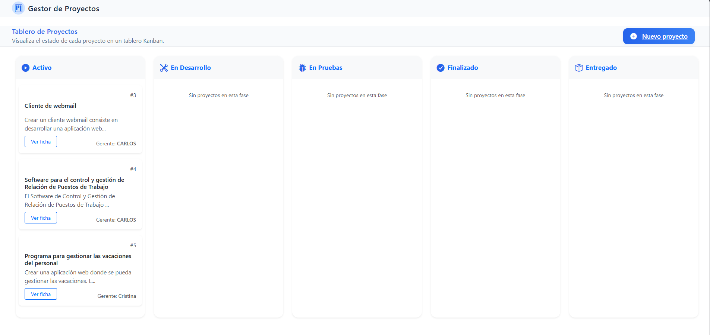
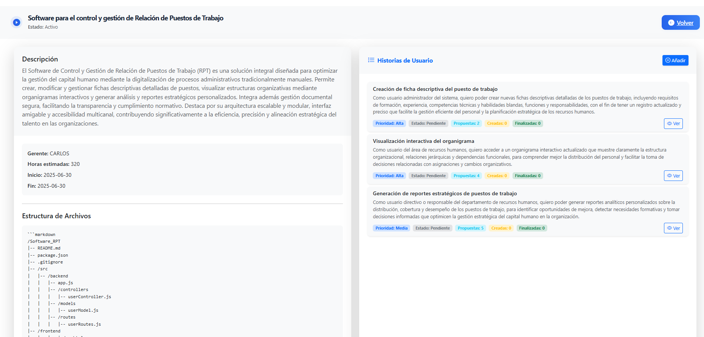
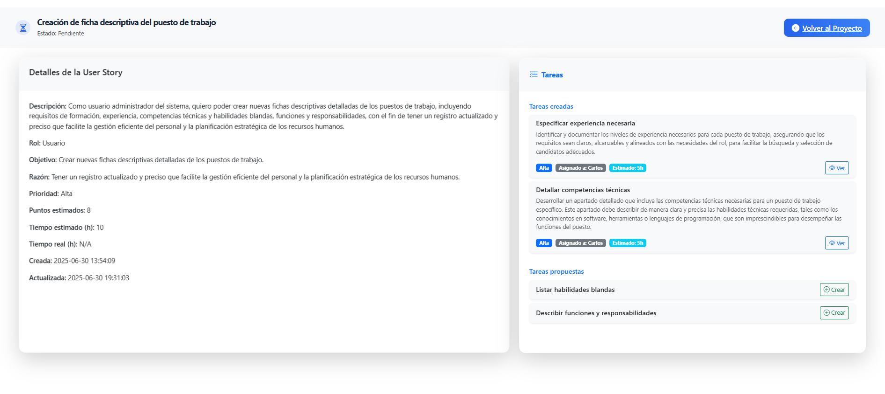

# Gestor de Proyectos, User Stories y Tareas con FastAPI + OpenAI

## Descripción General

Este proyecto es una aplicación web para la gestión de proyectos, user stories y tareas, integrando generación automática de fichas y desgloses mediante IA (OpenAI). Permite crear, visualizar y administrar proyectos, user stories y tareas, con operaciones CRUD completas y un tablero Kanban visual para el seguimiento de estados.

- Backend: FastAPI + SQLAlchemy + Alembic + MySQL
- Frontend: Jinja2 (plantillas HTML)
- Integración IA: OpenAI (GPT-4o)
- Pruebas: pytest + httpx

## Puesta en Funcionamiento

### 1. Clonar el repositorio y preparar el entorno

```bash
# Clona el repositorio y entra en la carpeta
# git clone <URL_DEL_REPO>
```

### 2. Configurar el archivo `.env`

Crea un archivo `.env` en la raíz del proyecto con el siguiente contenido (ajusta los valores si es necesario):

```env
MYSQL_HOST=localhost
MYSQL_PORT=3306
MYSQL_USER=user
MYSQL_PASSWORD=userpassword
MYSQL_DATABASE=userstories
OPENAI_API_KEY=sk-... (tu clave OpenAI)
OPENAI_MODEL=gpt-4o
```

> **Nota:** No compartas tu clave OpenAI públicamente.

### 3. Levantar la base de datos MySQL con Docker

```bash
docker-compose up -d
```
Esto creará un contenedor MySQL accesible en el puerto 3306.
Debes asegurarte de que Docker esté instalado y corriendo en tu máquina.

### 4. Instalar dependencias Python

Se recomienda usar un entorno virtual:

```bash
python -m venv venv
source venv/bin/activate  # En Windows: venv\Scripts\activate
pip install -r requirements.txt
```

### 5. Inicializar la base de datos (migraciones Alembic)

```bash
alembic upgrade head
```
Esto creará todas las tablas necesarias en la base de datos.

### 6. Arrancar la aplicación FastAPI

```bash
uvicorn main:app --reload
```
La aplicación estará disponible en http://localhost:8000

### 7. Acceso a la documentación interactiva

- Swagger UI: http://localhost:8000/docs

## Uso de la Aplicación

### Gestión de Proyectos
- Desde la página principal (`/`), puedes crear, ver, editar y eliminar proyectos.
- Al crear un proyecto, parte de la ficha se genera automáticamente usando IA.
- El tablero Kanban muestra los proyectos por estado.



### Gestión de User Stories
- Cada proyecto puede tener múltiples user stories.
- Las user stories pueden ser generadas y desglosadas por IA.
- Puedes ver, editar y eliminar user stories desde la ficha del proyecto.



### Gestión de Tareas
- Las tareas se asocian a user stories y pueden ser generadas automáticamente por IA.
- Puedes ver el detalle de cada tarea, editarla o eliminarla.



### Integración con OpenAI
- La integración con OpenAI permite automatizar varias tareas clave del sistema, delegando en la IA la generación de información estructurada y relevante en distintos puntos del flujo de trabajo:

#### Acciones delegadas en la IA:

1. **Generación de ficha de proyecto**
   - Al crear un nuevo proyecto, la descripción proporcionada por el usuario se envía como prompt a la IA.
   - La IA responde con:
     - Estructura de archivos recomendada para el proyecto.
     - Stack tecnológico sugerido.
     - Estimación de horas para completar el proyecto.
   - Estos datos se almacenan automáticamente junto con el proyecto.

2. **Generación de ficha de user story**
   - Al crear una user story, la definición inicial se envía a la IA.
   - La IA devuelve:
     - Nombre, descripción, rol, objetivo y razón de la user story.
     - Estimación de tiempo (horas) para la user story.
   - El usuario puede completar o ajustar los campos manuales (estado, prioridad, puntos, tiempo actual, fechas).

3. **Desglose de user story en tareas**
   - Desde la vista de una user story, el usuario puede solicitar a la IA que genere una lista de tareas asociadas.
   - La IA responde con una lista de tareas, cada una con:
     - Nombre, descripción, tiempo estimado.
   - El usuario puede asignar responsable, prioridad, estado y tiempo real a cada tarea.

4. **Validación de respuestas IA**
   - Todas las respuestas de la IA se validan contra los esquemas definidos (Pydantic) antes de almacenarse.
   - Si la respuesta no cumple el formato esperado, se muestra un error y se solicita reintentar.

#### Requisitos para la integración:

- Es imprescindible tener una clave válida de OpenAI y saldo suficiente en la cuenta.
- El modelo utilizado por defecto es `gpt-4o` (puedes cambiarlo en el archivo `.env`).
- La clave y el modelo se configuran en el archivo `.env`:
  ```env
  OPENAI_API_KEY=sk-... (tu clave OpenAI)
  OPENAI_MODEL=gpt-4o
  ```

> Si tienes dudas sobre el funcionamiento de la integración IA, revisa los endpoints en `/app/api/openai_integration.py` y la documentación en `/docs`.

### Pruebas Unitarias
- Las pruebas se encuentran en la carpeta `tests/`.
- Para ejecutarlas:

```bash
pytest
```

## Estructura del Proyecto

- `main.py`: Punto de entrada de la aplicación FastAPI.
- `app/models/`: Modelos SQLAlchemy.
- `app/schemas/`: Esquemas Pydantic.
- `app/crud/`: Lógica CRUD.
- `app/api/`: Rutas y endpoints.
- `app/templates/`: Plantillas HTML (Jinja2).
- `app/static/`: Archivos estáticos (CSS, JS, imágenes).
- `alembic/`: Migraciones de base de datos.
- `tests/`: Pruebas unitarias.
- `docker-compose.yml`: Configuración de la base de datos MySQL.
- `.env`: Variables de entorno (no subir a git).

## Notas y Recomendaciones

- No subas el archivo `.env` ni claves privadas al repositorio.
- Si cambias la estructura de la base de datos, recuerda crear y aplicar nuevas migraciones con Alembic.
- Para la integración con OpenAI, revisa los límites de uso y coste de la API.
- Si tienes problemas de conexión a la base de datos, revisa que el contenedor MySQL esté corriendo y que los datos de `.env` sean correctos.

---

Para cualquier duda, consulta los archivos `Entregable3_Instrucciones.md` y `Entregable3_PlandeTrabajo.md` incluidos en el proyecto.
